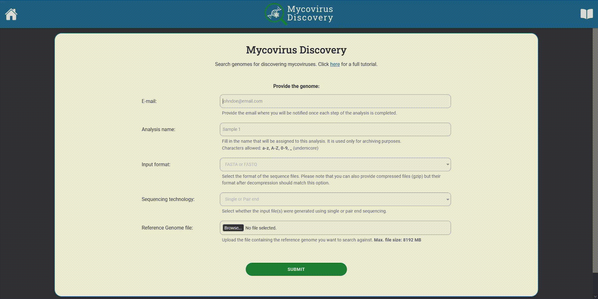
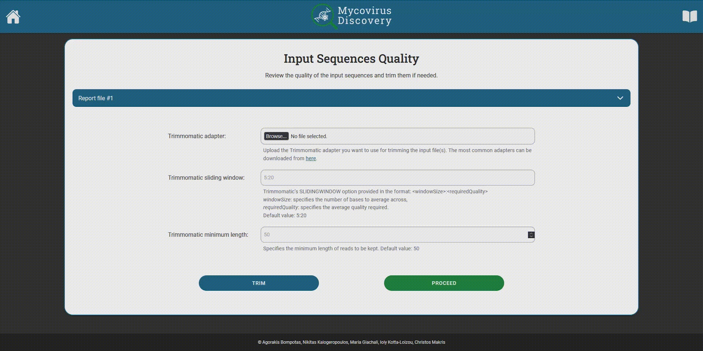

# MycoVirus Discovery - User Guide

## Step 1 - Provide files for analysis

Navigate to the tool's home page and fill all the fields:

- **E-mail:** This is where you will be notified once each step of the analysis is completed. If you want to ensure
  complete anonymity while using the tool you may consider an email masking service
  like [Firefox Relay](https://relay.firefox.com/).
- **Analysis name:** This is the name that will be assigned to then analysis you are about to run. It is used only
  for archiving purposes. Characters allowed: **a-z, A-Z, 0-9, _** (underscore)
- **Input format:** Whether the sequence files are provided in _FASTA_ or _FASTQ_ format. Please note that you can also
  provide compressed files (gzip) but their format after decompression should match this option.
- **Sequencing technology:** Whether the input file(s) were generated using single or pair end sequencing. Depending on
  your selection one or two fields will appear right below this field.
- **Input file:** The actual file you want ot analyze. If you selected the _Pair End_ option then you will have to
  upload two input files, _forward_ and _reverse_.
- **Reference Genome file:** This is the file that contains the reference genome you want to search against

After providing all the input data click on the green **Submit** button that is located below the form. Your inputs will
be checked for errors or omissions and will be queued for analysis. Once the first step of this analysis is completed
you will receive an email containing a link for navigating to step 2.

**Important:** Please be patient and do not close your browser while the files are uploading as this process may last
several minutes.

### Demo Inputs:

For easier testing of the application you can try it with the following input data:

- **Sequencing technology:** Paired end
- **Input files:**
  [GSM4478256: whole cells, ITC; [Candida] auris; RNA-Seq (SRR11550480)](https://trace.ncbi.nlm.nih.gov/Traces/?view=run_browser&acc=SRR11550480&display=download)
- **Reference genome:**
  [Candidozyma auris B11221 ASM3135756v2](https://www.ncbi.nlm.nih.gov/datasets/genome/GCA_031357565.2/)

## Step 2 - Trim the input file

During the first step, the quality of the input files is checked using the FastQC tool. Once the analysis is complete an
email with the link to the second step is sent to the address that you provided. By clicking this link (or
copying/pasting to your browser) you will be navigated to a screen that shows the analysis results and gives you two
options:

- If you are content with the quality of your input file, you can click the green _Proceed_ button to continue the virus
  discovery process
- Otherwise you may choose to trim your input sequences by filling the form (see
  __[Options for trimming](#options-for-trimming)__) and clicking the blue _Trim_ button. When trimming is completed you
  will receive a new email with a link containing the report of the trimmed sequences. This
  step can be repeated as many times as you like. Every time the trimming occurs to the original sequences.

### Options for trimming

These are the options you can tweak to better the quality of your sequences:

- **Trimmomatic adapter:** This is the Trimmomatic adapter you want to use for trimming the input file(s). The most
  common
  adapters can be downloaded from [here](https://github.com/timflutre/trimmomatic/tree/master/adapters).
- **Trimmomatic sliding window:** Trimmomatic's SLIDINGWINDOW option provided in the
  format: _\<windowSize\>:\<requiredQuality\>_, e.g.: 5:20
    - windowSize: specifies the number of bases to average across,
    - requiredQuality: specifies the average quality required.
- **Trimmomatic minimum length:** Specifies the minimum length of reads to be kept.

## Step 3 - View the results

Once the Virus Discovery process is finished, a new email is sent with a link to the final results. There you view
the results in our tool's web viewer or you can download them for further analysing them.

